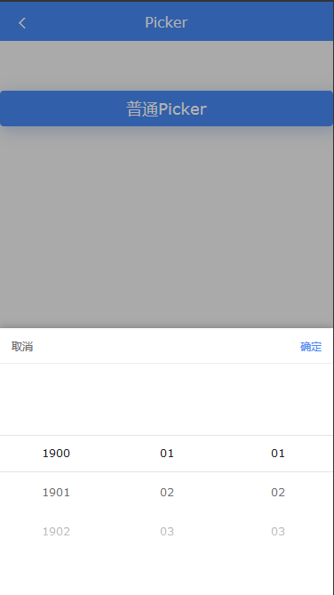

# mobile-picker.js
移动端滚轮组件 - mobile picker

## 基础用法
```
var datalist = [['item-1','item-2','item-3'],['item-4','item-5','item-6']];
const picker = zfui.picker();
picker.renderNormal([0, 0], datalist);
```

## 更新轮子
```
picker.updatePicker(1, ['item-2','item-2','item-3']);
```

## 事件监听
```
// 监听，点击确定按钮时触发
picker.event('onClose', res=>{
	console.log(res);
});

// 监听，轮子滚动结束时触发
picker.event('onMoveEnd', res=>{
	console.log(res);
});
```

## picker属性
| 属性 | 类型 | 默认值 | 必填 | 说明 |
| ---- | ---- | ------ | ---- | ---- |
| renderNormal | Array,Array | [],[] | 是,是 | param1：默认显示的行，param2中显示的数据 |
| updatePicker | Int,Array | 无,无 | 是,是 | param1：轮子的列数，param2需替换的数据 |
| event | eventhandle | 无,无 | 是,是 | 可选onClose,onMoveEnd |

## 效果图

